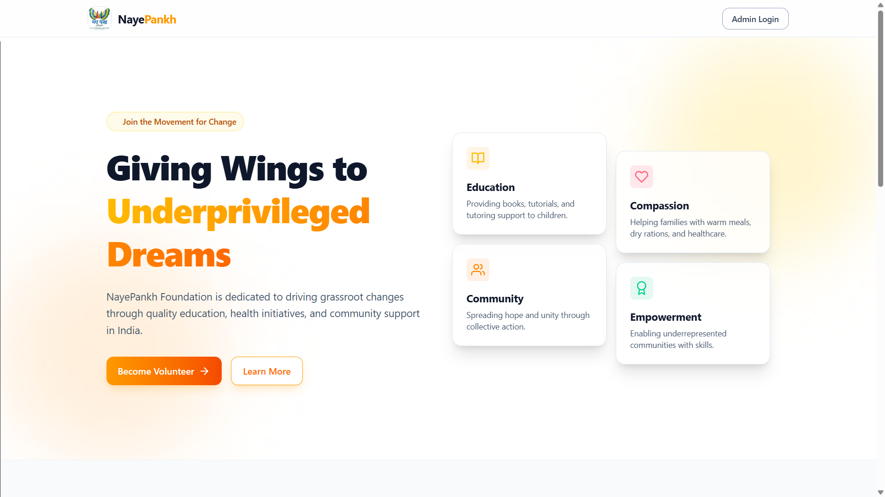
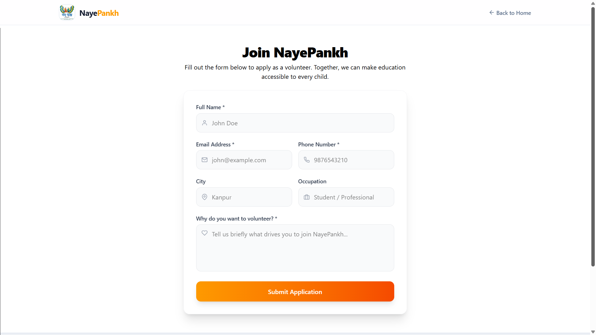
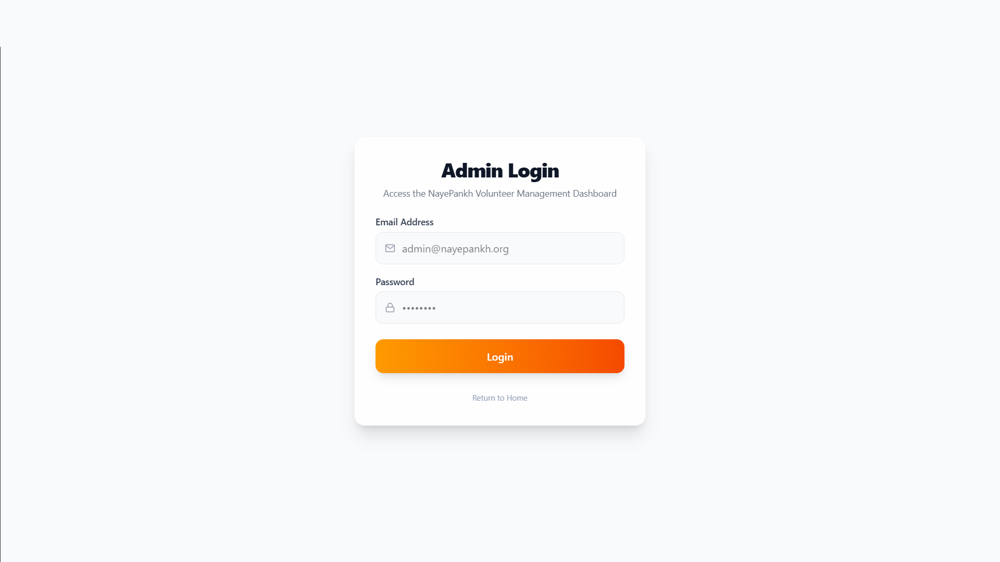
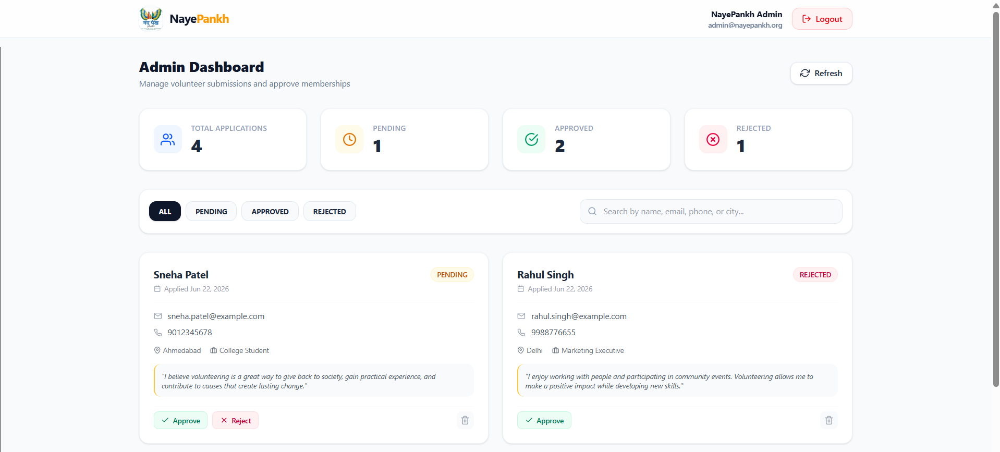
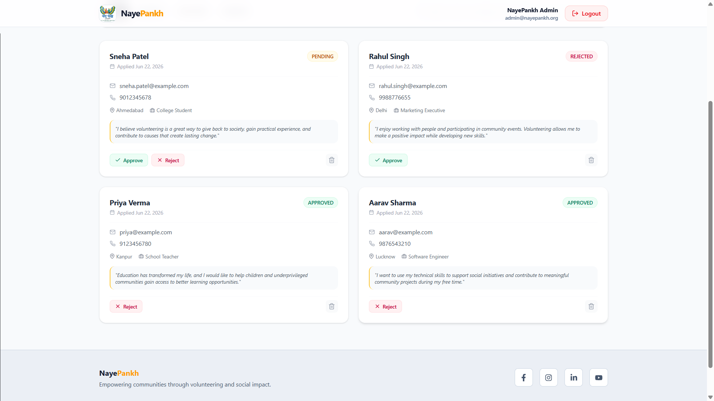

# Volunteer Registration System

A full-stack Volunteer Registration System built with the MERN Stack that helps organizations manage volunteer applications, approvals, and volunteer data through a centralized admin dashboard.

## 📌 Features

### Public Website

- Responsive landing page
- Become a Volunteer CTA
- Volunteer registration form
- Application submission workflow
- Status tracking

### Volunteer Management

- Volunteer application submission
- Pending approval system
- Approved / Rejected status management
- Volunteer profile management

### Admin Dashboard

- Secure admin authentication
- Dashboard overview
- Manage volunteer applications
- Approve or reject volunteers
- Search and filter volunteers
- Manage volunteer records

### Authentication & Security

- JWT Authentication
- HTTP-Only Cookie Storage
- Password Hashing using bcryptjs
- Protected Routes
- Role-Based Access Control

---

## 🛠 Tech Stack

### Frontend

- React.js
- React Router
- Axios
- Context API
- Tailwind CSS

### Backend

- Node.js
- Express.js
- MongoDB
- Mongoose

### Authentication

- JWT
- bcryptjs
- Cookie Parser

---

# 🚀 Installation

## 1. Clone Repository

```bash
git clone https://github.com/shivanshusonwani/volunteer-registration-system.git

cd volunteer-registration-system
```

---

## 2. Install Backend Dependencies

```bash
cd backend

npm install
```

---

## 3. Configure Environment Variables

Create a `.env` file inside the `backend` directory.

```env
PORT=5000

MONGO_URI=your_mongodb_connection_string

JWT_SECRET=your_super_secret_key

ADMIN_EMAIL=admin@example.com
ADMIN_PASSWORD=admin123

NODE_ENV=development

CLIENT_URL=http://localhost:5173
```

### Admin Account Creation

On server startup, the application automatically checks whether an admin account exists.

If no admin account is found, a default admin user is created using the credentials provided in the `.env` file.

No separate seed script is required.

---

## 4. Install Frontend Dependencies

```bash
cd ../frontend

npm install
```

---

# ▶️ Running The Project

## Start Backend

```bash
cd backend

npm run dev
```

Server runs on:

```text
http://localhost:5000
```

When the backend starts for the first time:

- Creates the admin account automatically (if it does not already exist)
- Connects to MongoDB
- Starts the API server

---

## Start Frontend

```bash
cd frontend

npm run dev
```

Frontend runs on:

```text
http://localhost:5173
```

---

# 🔑 Admin Login

Use the credentials configured in your `.env` file:

```text
Email:
ADMIN_EMAIL

Password:
ADMIN_PASSWORD
```

Example:

```text
Email:
admin@example.com

Password:
admin123
```

⚠️ For production deployments, use a strong password and change the default credentials before launching the application.

---

# 📸 Screenshots

## Landing Page



Features:

- Hero Section
- NGO Introduction
- Become Volunteer CTA
- Responsive Design

---

## Volunteer Registration



Features:

- Volunteer Application Form
- Validation
- Easy Registration Process

---

## Admin Login



Features:

- Secure Authentication
- JWT Based Login
- Protected Dashboard Access

---

## Dashboard Overview



Features:

- Total Volunteers
- Pending Applications
- Approved Volunteers
- Quick Statistics

---

## Volunteer Management



Features:

- View All Applications
- Search Volunteers
- Approve / Reject Requests
- Update Volunteer Information

---

---

# Author

**Shivanshu Sonwani**

Software Developer specializing in MERN Stack and modern web applications.

If you like this project, feel free to ⭐ the repository and check out my other work.

---
